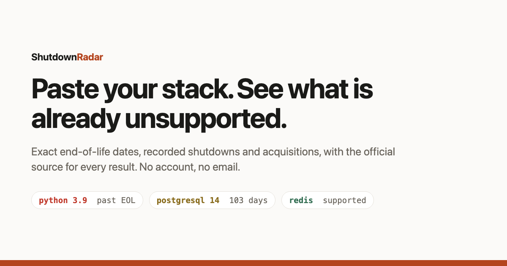

# Stack Risk Check

**Paste a list of technologies. Find out which ones are already unsupported.**

→ **[Try it](https://shutdown-radar.pages.dev/check?src=github)** · no login, no email, nothing you type leaves your browser



---

## The problem

The information exists but is scattered. Support dates live on each vendor's own page in their own
format, shutdown announcements live in threads that scroll away, and a repository being archived is
only visible if you happen to look at it. Answering *"is anything we run already unsupported?"*
means checking each item by hand, so it doesn't get done — until an auditor, a customer security
questionnaire, or a broken build forces it.

For context, from the dataset behind this tool: **of 8,270 tracked releases across 446 products,
6,509 — 78% — are already past their published end-of-life date.** The answer is rarely "nothing."

## Example input

```
python 3.9
postgresql 14
kubernetes 1.28
node 18
redis
frobnicator quantum db
```

Versions are optional. With one, you get a result for that exact release; without one, you get the
product-level position. Aliases are handled — `node` → `nodejs`, `k8s` → `kubernetes`,
`postgres` → `postgresql`.

## Example results

| Input | Severity | Finding |
|---|---|---|
| `python 3.9` | **urgent** | Passed end of life on 2025-10-31; no longer receives security patches |
| `kubernetes 1.28` | **urgent** | Passed end of life on 2024-10-28 |
| `node 18` | **urgent** | Passed end of life on 2025-04-30 |
| `postgresql 14` | **watch** | Loses support 2026-11-12 — 103 days remaining |
| `redis` | **watch** | Next release to lose support is 8.0 on 2026-12-01 |
| `frobnicator quantum db` | **unknown** | Not in the dataset — nothing was found, *not* that it is safe |

Every factual line in the live tool links to its source so you can verify it rather than trust it.

## How severity is calculated

Severity is **derived, never invented.** There is no scoring model and no risk heuristic — every
classification traces to a published date or a dated event.

| Severity | Rule |
|---|---|
| `urgent` | The named release is past its published EOL date, **or** a shutdown/archival event is on record for the product |
| `upcoming` | Published EOL within **90 days** |
| `watch` | Published EOL within **365 days**, **or** an acquisition / breach / pricing-change event is on record |
| `clear` | Tracked, supported, nothing on record |
| `unknown` | Could not be resolved in the dataset |

Two rules that matter:

- **Recorded events can only raise severity, never lower it.** A healthy release schedule does not
  cancel out the fact that the product was archived.
- **`unknown` is never reported as `clear`.** Absence of evidence is not evidence of safety, and
  conflating the two is the most damaging mistake a tool like this can make.

The reference implementation is [`src/severity.py`](src/severity.py), with tests in
[`src/severity_test.py`](src/severity_test.py):

```bash
cd src && python3 -m unittest severity_test -v
```

If the live tool ever disagrees with that file, **the tool has a bug** — please report it.

## Data sources

| Source | Used for | Notes |
|---|---|---|
| [endoflife.date](https://endoflife.date) | Version support and end-of-life dates | An open, community-maintained dataset that cites vendor announcements. This project is a *reader* of it, not its author. Every lifecycle result links back to the corresponding endoflife.date page |
| Hacker News search API (Algolia) | Shutdown, EOL, acquisition and pricing announcements | Public headlines, dates and the submitted link only |
| GitHub REST API | Repositories archived by their own owners | First-party: the maintainer flipped the switch, with a date. Limited to widely-adopted projects |

**For any compliance decision, use the vendor's own notice as the authority**, not this tool and not
endoflife.date.

## Sample data

- [`data/sample-lifecycles.json`](data/sample-lifecycles.json) — lifecycle records for 14 products,
  in the exact shape the classifier consumes
- [`data/sample-events.json`](data/sample-events.json) — 54 representative archived events across
  every category

These are samples for verifying the data shape and reproducing the logic, not the full archive.

## Privacy

- **The check runs entirely in your browser** against a static JSON file. The technologies you
  enter are never transmitted — not to this project, not to anyone.
- No cookies, no localStorage, no fingerprinting, no advertising, no cross-site identifier.
- The only thing recorded is an anonymous counter: that a check happened, and how many items were
  in it. **Never which ones.**
- Because there is deliberately no visitor identifier, per-person metrics such as returning
  visitors are **not measurable** here. That is a real cost of the design, and it is stated rather
  than approximated.
- A shareable result link contains only the technology names you typed.

## Known limitations

Stated plainly, because a tool like this is worth exactly as much as its honesty about what it
does not know.

- **Coverage is uneven.** Strongest for languages, databases, infrastructure and developer tooling.
  **Weak for business SaaS.** If your stack is mostly commercial SaaS, this will find little.
- **`unknown` means not found, not safe.** Verify those against the vendor directly.
- **Name matching is pattern-based and imperfect.** A real bug shipped where `jquery-file-upload`
  matched jQuery and reported the wrong lifecycle. It is fixed; others almost certainly exist.
- **Dates are re-published, not original.** They are only as current as endoflife.date.
- **Extended and paid support contracts are not modelled.** If you hold one, your real dates may be
  later than shown.
- **Nothing is scanned or discovered.** Results reflect the versions *you* type. Wrong input, wrong
  output.
- **This is not a security assessment.** Unsupported does not mean exploited; supported does not
  mean safe. It reports support status only.

## Reporting a wrong match or missing technology

Please do — these are the most useful contributions to this project.

- **[Report a false match](../../issues/new?template=false-match.yml)** — the tool returned the
  wrong product or the wrong dates
- **[Request a missing technology](../../issues/new?template=missing-technology.yml)** — something
  you run that it does not recognise
- **[Report a bug](../../issues/new?template=bug-report.yml)** — anything else

A false match is a more serious problem than a gap, and is treated as such. See
[CONTRIBUTING.md](CONTRIBUTING.md).

## Status

**Experimental.** Built and maintained by one person, launched in 2026, and actively changing.

**This is not compliance advice.** It is not a substitute for a software asset management tool, a
security assessment, or your vendor's own end-of-life notice. Do not present its output as evidence
in an audit without verifying every line against the primary source.

## License

Code is [MIT](LICENSE). Lifecycle data belongs to
[endoflife.date](https://endoflife.date) and its contributors; vendor names and trademarks belong to
their owners and are used descriptively, implying no affiliation or endorsement.
